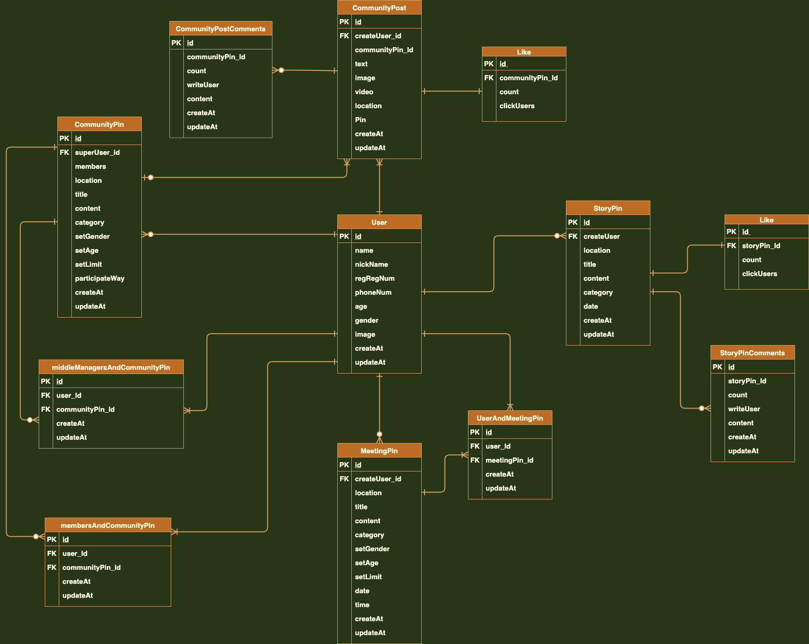

# Pins_backend

# Introduction
> 
> 
> 

&nbsp;
&nbsp;
&nbsp;

# DB modeling
ERD v2.0

&nbsp;
&nbsp;
&nbsp;

Tables 1

&nbsp;
&nbsp;

Tables 2

&nbsp;
&nbsp;
&nbsp;

# Technologies
-
-

&nbsp;
&nbsp;
&nbsp;

# Features

**User**
-
-
-

&nbsp;
&nbsp;
&nbsp;

# API Documentiaion
[.](https://github.com/wecode-bootcamp-korea/we-fish-backend/blob/master/README.md)

&nbsp;
&nbsp;
&nbsp;

# Contact
- 

&nbsp;
&nbsp;
&nbsp;

# 깃 커밋 유형
* FEAT : 새로운 기능의 추가
* FIX: 버그 수정
* DOCS: 문서 수정
* STYLE: 스타일 관련 기능(코드 포맷팅, 세미콜론 누락, 코드 자체의 변경이 없는 경우)
* REFACTOR: 코드 리펙토링
* TEST: 테스트 코트, 리펙토링 테스트 코드 추가
* CHORE: 빌드 업무 수정, 패키지 매니저 수정(ex .gitignore 수정 같은 경우)
